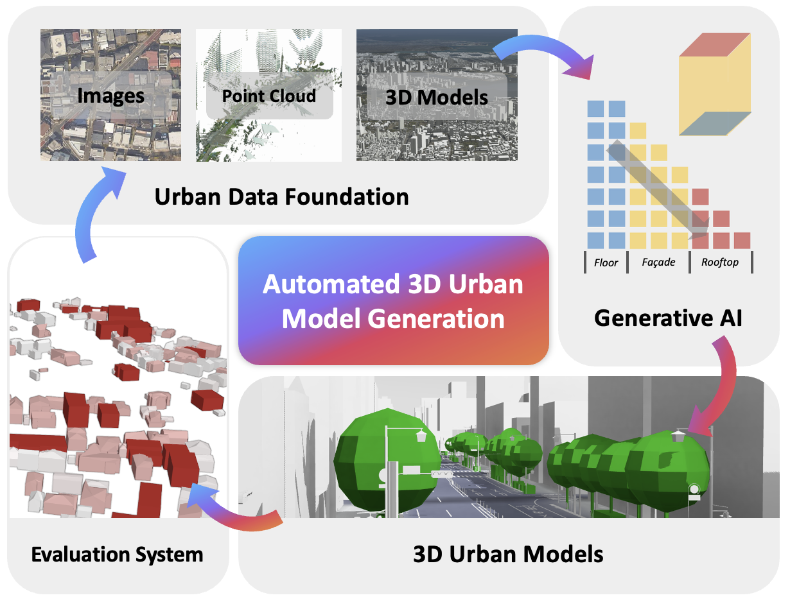

# 3D City Model Generator



The 3D City Model Generator is an open-source web-based authoring tool for generating CityGML-compatible semantic 3D city models from heterogeneous urban data.

The tool supports buildings, roads, vegetation, city furniture, and terrain-related urban context, and exports generated objects in PLATEAU-compatible CityGML format. It is designed to generate city models at LoD1, LoD2, and LoD3 by combining building footprint data, satellite or orthophoto imagery, roadside imagery, MMS or point-cloud data, OpenStreetMap-derived road information, and user-defined generation parameters.

This repository publishes the source code of the 3D city model generation tool developed under Project PLATEAU in Japanese fiscal year 2025. The project was conducted as part of research and demonstration work toward urban digital twins under the BRIDGE program, "Programs for Bridging the gap between R&D and the Ideal society and Generating Economic and social value."

Project documentation is also available on the GitHub Pages site:

https://project-plateau.github.io/3D-City-Model-Generator/index.html

## Key Features

- Web-based authoring interface for importing, generating, visualizing, and exporting 3D city model data.
- Building model generation from building footprints and generation parameters.
- LoD1, LoD2, and LoD3 generation workflows.
- Satellite or orthophoto reference workflow for extracting building outlines, roof forms, roads, and vegetation distribution.
- Roadside image and MMS or point-cloud reference workflow for LoD3 opening-related information.
- Road model generation using OpenStreetMap-derived road information.
- Terrain or context-surface handling when compatible elevation or surface data are available.
- Vegetation and city furniture generation by type and LoD.
- Interactive visualization of generated 3D city models in the web UI.
- Export of generated assets in PLATEAU v4-compatible CityGML workflows and OBJ-based preview assets.

## Repository Structure

```text
3D-City-Model-Generator/
  README.md                 English README for reviewers and users
  README_JP.md              Japanese README
  LICENSE                   Repository license
  environment.yml           Conda environment definition for Python 3.9
  requirements.txt          Python dependencies for model and processing code
  BldgGen2025/              Core generation models and geospatial processing code
    BldgXL_3x/              Building generation model implementation
    gen_bg/                 Road, vegetation, city furniture, and merged asset generation
    gen_bg_lod3/            LoD3-oriented asset generation utilities
    utils/                  Geometry, raster, and preprocessing utilities
  BridgeUI/                 Web frontend and backend integration
    src/                    React/Vite frontend
    backend/                Flask backend API for upload, processing, and download
    demo-lod2/              Demo LoD2 OBJ/MTL output
    demo-lod3/              Demo LoD3 OBJ/MTL output
    demo-lod3-new/          Additional LoD3 demo output
    README_img/             UI screenshots
  figure/                   Overview and workflow figures
```

## System Requirements

The recommended environment follows the Japanese project documentation.

| Item | Minimum | Recommended |
| --- | --- | --- |
| OS | Ubuntu 20.04 or later | Ubuntu 20.04 or later |
| Python | Anaconda with Python 3.9 | Anaconda with Python 3.9 |
| GPU | NVIDIA GPU with at least 16 GB memory | NVIDIA A100 |
| CUDA | CUDA 11.3 or later | CUDA 12.4 |
| Node.js | Required for BridgeUI | Current LTS version |

The frontend is a React/Vite application. The backend is a Python Flask service that connects the UI to upload, processing, preview, and download workflows.

## Installation

Clone the repository:

```bash
git clone https://github.com/Project-PLATEAU/3D-City-Model-Generator.git
cd 3D-City-Model-Generator
```

Create the Python environment:

```bash
conda env create -f environment.yml
conda activate gen3d_UI_2025
pip install -r requirements.txt
```

Install the web UI dependencies:

```bash
cd BridgeUI
npm install
```

## Quick Start

Start the frontend and backend together:

```bash
cd BridgeUI
npm run dev:full
```

By default, the frontend is served by Vite and the backend is served by Flask on localhost. The backend script in this repository binds to `127.0.0.1:5001`.

You can also start them separately:

```bash
cd BridgeUI
npm run backend
npm run dev
```

Then open the local Vite URL shown in the terminal, usually:

```text
http://localhost:5173
```

## Example Workflow

1. Start BridgeUI with `npm run dev:full`.
2. Import a building footprint file, such as GeoJSON.
3. Select the target LoD.
4. Add optional orthophoto, satellite image, point-cloud, MMS, or roadside image data depending on the target workflow.
5. Run model generation from the web interface.
6. Inspect the generated 3D model in the viewer.
7. Download or export the generated result.

The repository currently includes demo OBJ/MTL outputs under:

- `BridgeUI/demo-lod2/`
- `BridgeUI/demo-lod3/`
- `BridgeUI/demo-lod3-new/`

These files are useful for checking visualization and export behavior before running a full model-generation workflow.

## Input Data

The tool is intended to work with heterogeneous urban data. Supported or expected inputs include:

| Input | Purpose |
| --- | --- |
| Building footprints, GeoJSON, or compatible vector data | Building footprint geometry and attributes such as height |
| Satellite or orthophoto imagery, including GeoTIFF | Reference imagery for building, roof, road, and vegetation extraction |
| OpenStreetMap road data | Road network and related urban asset placement |
| MMS or point-cloud data | LoD3 reconstruction and facade/opening reference |
| Roadside or street-view images | LoD3 facade and opening-related information |
| User parameters | LoD, scale, target feature types, roof or design parameters, and generation options |

When using third-party data, users must comply with the original data license and attribution requirements. This is especially important for PLATEAU data, OpenStreetMap data, MMS imagery, satellite imagery, and roadside images.

## Output Data

Generated outputs include:

- Building models at LoD1, LoD2, or LoD3.
- Road models.
- Vegetation models.
- City furniture models.
- Terrain or context-surface assets when supplied by the workflow.
- Merged 3D model preview assets.
- PLATEAU-compatible CityGML-oriented outputs.
- OBJ/MTL files for visualization and intermediate preview workflows.

CityGML export is intended to follow the PLATEAU v4-compatible workflow described in the project documentation. Reviewers should check generated CityGML files together with the corresponding input data, LoD setting, and generation parameters.

## Main Components

### Core Generation

`BldgGen2025/` contains model and geometry processing code for:

- Footprint loading and polygon-to-mesh conversion.
- Building generation with BldgXL-based model components.
- Road, vegetation, and city furniture generation.
- LoD3-oriented opening and asset handling.
- Raster cropping, geometry processing, and utility functions.

### Web Interface

`BridgeUI/` contains:

- React/Vite frontend.
- Flask backend API.
- File upload and job tracking endpoints.
- OBJ/MTL preview assets.
- Viewer and generation workflow UI.

The backend API includes endpoints for upload, status polling, result download, job listing, deletion, and health checks.

## Reproducibility Notes for CEUS Review

For a CEUS software paper, this repository should be treated as research software rather than only a code archive. The following items are present in this repository:

- Source code for the core generation pipeline.
- Web frontend and backend code.
- Python dependency files: `environment.yml` and `requirements.txt`.
- UI and workflow figures.
- Demo OBJ/MTL outputs for LoD2 and LoD3 visualization checks.
- Repository license file.

The following items are recommended before manuscript submission or public archival release:

- Add `CITATION.cff` with the paper citation, software version, release date, license, and DOI.
- Create a stable GitHub release, for example `v1.0.0` or `v1.0.0-ceus-submission`.
- Archive the release on Zenodo and add the Zenodo DOI to `CITATION.cff` and this README.
- Add a `NOTICE` file for third-party software, PLATEAU data, OpenStreetMap attribution, sample data attribution, and model-weight licenses.
- Add a small legally cleared `sample_data/` directory or provide DOI-based download instructions for larger reproducibility data.
- Add `docs/` pages for installation, quick start, input data, output CityGML, parameters, examples, troubleshooting, and FAQ.
- Add `configs/` files for default, LoD1, LoD2, LoD3, CityGML export, and paper case-study settings.
- Add minimal tests, especially CityGML export and geometry quality checks.
- Add GitHub Actions for dependency installation and basic validation.

## Citation

If you use this software in research, please cite the associated software paper and archived software release.

```text
Citation information will be provided in CITATION.cff after the CEUS submission
release and Zenodo DOI are created.
```

Recommended `CITATION.cff` fields for the release:

```yaml
cff-version: 1.2.0
title: "3D City Model Generator"
message: "If you use this software, please cite the following paper."
type: software
authors:
  - family-names: "..."
    given-names: "..."
version: "1.0.0"
date-released: "2026-05-31"
url: "https://github.com/Project-PLATEAU/3D-City-Model-Generator"
doi: "10.xxxx/zenodo.xxxxxxx"
license: "MIT"
```

## Software Availability Statement

The 3D City Model Generator is released as open-source software at:

https://github.com/Project-PLATEAU/3D-City-Model-Generator

The version used in the accompanying paper should be archived on Zenodo and cited with its DOI:

```text
[Zenodo DOI to be added after release archival]
```

The repository includes source code, documentation, installation instructions, dependency files, demo outputs, and web-based workflows for generating and checking 3D city model outputs. The software is distributed under the license specified in `LICENSE`.

## License

This repository currently includes an MIT license in `LICENSE`.

Users must separately verify the usage terms of any third-party input data, pretrained model weights, sample data, imagery, and derived datasets. In particular:

- PLATEAU data and documentation may have separate terms and attribution requirements.
- OpenStreetMap-derived data must attribute OpenStreetMap contributors.
- MMS, roadside image, satellite image, and orthophoto data may require separate permission.
- Pretrained model weights, if distributed separately, should include their own license or model card.

## References

- [Project PLATEAU](https://www.mlit.go.jp/plateau/)
- [3D City Model Generator documentation site](https://project-plateau.github.io/3D-City-Model-Generator/index.html)
- [MeshXL](https://arxiv.org/abs/2405.20853)
- [MeshGPT](https://arxiv.org/abs/2311.15475)
- [MeshAnything](https://arxiv.org/abs/2406.10163)
- [ControlBldg](https://doi.org/10.1016/j.isprsjprs.2025.09.026)
- [BldgWeaver](https://doi.org/10.5194/isprs-annals-X-4-W6-2025-145-2025)

## Contact and Maintainer

Please use GitHub Issues for bug reports, reproducibility questions, and feature requests:

https://github.com/Project-PLATEAU/3D-City-Model-Generator/issues

Maintainer information should be updated before the CEUS submission release.
