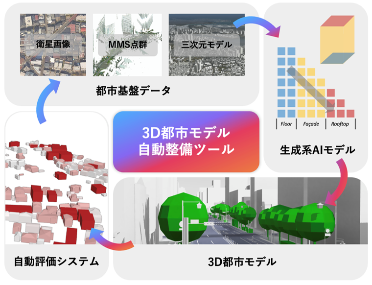

# 3D都市モデル生成シミュレータ

## 1. 概要

本リポジトリでは、令和7年度 Project PLATEAU において開発された「3D都市モデル生成ツール」のソースコードを公開しています。

「3D都市モデル生成ツール」は、建物フットプリントデータおよびユーザーが指定するパラメータに基づき、建築物、道路、植生、都市設備を含む3D都市モデルを自動生成するWebベースのオーサリングツールです。本ツールは、衛星画像や沿道画像を対象とした3D都市モデルの作成に対応しており、LOD1〜LOD3の詳細度に対応しています。

※本プロジェクトは、令和7年度「都市デジタルツインの実現に向けた研究開発及び実証調査業務」（内閣府「研究開発とSociety 5.0との橋渡しプログラム（BRIDGE）」）の一部として実施されました。

## 2. 「3D都市モデル生成ツール」について

「3D都市モデル生成シミュレータ」プロジェクトは、3D都市モデルのアクセシビリティおよびスケーラビリティを向上させ、都市デジタルツインの構築にかかるコストや工数の削減を目的としています。この目的の達成に向けて、最新の自動生成AI技術を中核とする3D都市モデル生成シミュレータを開発しました。

本シミュレータは、建築物、道路、都市設備、植生といった主要な都市要素に対応しており、LOD（詳細レベル）をユーザーが任意に設定できる設計となっています。また、生成した3D都市モデルはCityGML形式で出力可能であり、ツール上での可視化および操作にも対応しています。

## 3. 利用手順

本システムの構築手順及び利用手順については利用チュートリアルを参照してください。

## 4. システム概要

### 【3D都市モデル生成】

1. **衛星画像リファレンス機能**  
   - 衛星画像に基に、建物輪郭・屋根形状・道路・植生を抽出するとともに、それらの空間分布に基づき、AIを用いて3D都市モデルを生成します。
   - インスタンスセグメンテーションやセマンティックセグメンテーション等を用いたアルゴリズムを採用しています。

2. **沿道映像リファレンス機能 (LOD3のみ)**  
   - 沿道映像からLOD3に必要な開口部情報に関するパラメータを抽出します。  
   - 三次元再構築、セグメンテーション、点群ラベリングを用いたアルゴリズムを採用しています。

3. **パラメータ設定機能**  
   - LOD、スケール、対象地物などの汎用的なパラメータを設定可能です。

4. **実際の都市における仮想3D建築物モデル生成機能**  
   - パラメータ(LOD, 建物輪郭、屋根形状，高さ)に基づいて、3D建築物を生成し、CityGML(PLATEAU v4)形式で出力します。  
   - PLATEAUの3D建築物モデルを学習して、衛星画像と沿道画像（LOD3の場合）から3D建築物モデルを生成します。

5. **道路モデル生成機能**  
   - LOD, 道路種別に基づいて、OSMから道路モデルを生成し配置します。  
   - CityGML (PLATEAU v4) 形式で出力されます。

6. **植生モデル生成機能**  
   - LOD, 種別に基づいて、植生モデルを生成し配置します。  
   - CityGML (PLATEAU v4) 形式で出力されます。

7. **都市設備モデル生成機能**  
   - LOD, 種別に基づいて、都市設備モデルを生成し配置します。  
   - CityGML (PLATEAU v4) 形式で出力されます。

8. **可視化機能**  
   - 生成した3D都市モデルはツール上で可視化されます。

## 5. 利用技術
| 種別         | 名称                                                                                                        | バージョン  | 内容                                                                                                              |
| ------------ | ----------------------------------------------------------------------------------------------------------- | ----------- | ----------------------------------------------------------------------------------------------------------------- |
| ソフトウェア | [PyCharm Community](https://www.jetbrains.com/pycharm/)                                                     | -           | Pythonで開発する際に使用するソフトウェア                                                                            |
|              | [Visual Studio Code](https://code.visualstudio.com/)                                                        | -           | C++で開発する際に使用するソフトウェア                                                                               |
| ライブラリ   | [Computational Geometry Algorithms Library (CGAL)](https://www.cgal.org/)                                   | -           | メッシュを生成、最適化する際に使用するライブラリ                                                                      |
|              | [PyTorch](https://pytorch.org/)                                                              | -            | 深層学習モデルの構築・訓練・推論を行うための主要フレームワーク                                |
|              | [torchvision](https://pytorch.org/vision/stable/)                                            | -            | 画像データの読み込みや前処理、モデルの実装を提供するライブラリ                                |
|              | [accelerate](https://github.com/huggingface/accelerate)                                      | 1.0.0        | 分散学習やマルチGPU環境でのトレーニングを簡素化するライブラリ                                  |
|              | [transformers](https://huggingface.co/transformers)                                          | 4.45.2       | NLP・CV向けの事前学習モデルを提供するライブラリ                                               |
|              | [datasets](https://github.com/huggingface/datasets)                                          | 3.1.0        | 機械学習用データセットの管理・前処理を行うライブラリ                                          |
|              | [open_clip_torch](https://github.com/mlfoundations/open_clip)                                | 2.26.1       | CLIPモデルの実装を提供し、画像と言語のマルチモーダル理解を実現                                |
|              | [clip](https://github.com/openai/CLIP)                                                       | -            | 画像と言語の対応関係を学習するマルチモーダルモデル                                            |
|              | [timm](https://github.com/rwightman/pytorch-image-models)                                    | 1.0.9        | 画像分類モデルを多数提供するPyTorchベースのライブラリ                                          |
|              | [einops](https://github.com/arogozhnikov/einops)                                             | 0.8.0        | テンソル操作を直感的に記述できるライブラリ                                                    |
|              | [vector-quantize-pytorch](https://github.com/lucidrains/vector-quantize-pytorch)             | 1.17.8       | ベクトル量子化（VQ）を実装するためのライブラリ                                                 |
|              | [ema-pytorch](https://github.com/lucidrains/ema-pytorch)                                     | 0.7.0        | EMA（指数移動平均）によるモデル安定化を実現するライブラリ                                     |
|              | [x-transformers](https://github.com/lucidrains/x-transformers)                               | 1.30.23      | Transformerモデルの拡張実装を提供するライブラリ                                               |
|              | [local-attention](https://github.com/lucidrains/local-attention)                             | 1.9.15       | 局所注意機構を実装するライブラリ                                                              |
|              | [rotary-embedding-torch](https://github.com/lucidrains/rotary-embedding-torch)               | 0.8.4        | Rotary positional embeddingを実装するライブラリ                                               |
|              | [gateloop-transformer](https://github.com/lucidrains/gateloop-transformer)                   | 0.2.5        | Transformerの改良モデルを提供するライブラリ                                                   |
|              | [taylor-series-linear-attention](https://github.com/lucidrains/taylor-series-linear-attention) | 0.1.12       | 線形注意機構を近似するためのライブラリ                                                        |
|              | [classifier-free-guidance-pytorch](https://github.com/cloneofsimo/classifier-free-guidance-pytorch) | 0.7.1 | 生成モデルのガイダンス手法を実装するライブラリ                                                |
|              | [opencv-python](https://opencv.org/)                                                         | 4.10.0.84    | 画像処理・コンピュータビジョン用ライブラリ                                                    |
|              | [scikit-image](https://scikit-image.org/)                                                    | 0.24.0       | 画像処理アルゴリズムを提供するライブラリ                                                      |
|              | [imageio](https://imageio.readthedocs.io/)                                                   | 2.36.0       | 画像・動画の読み書きを行うライブラリ                                                          |
|              | [tifffile](https://github.com/cgohlke/tifffile)                                              | 2024.8.30    | TIFF形式の画像データを扱うライブラリ                                                          |
|              | [Pillow](https://python-pillow.org/)                                                         | 10.4.0       | Pythonの画像処理ライブラリ                                                                    |
|              | [numpy](https://numpy.org/)                                                                  | 1.26.4       | 数値計算・配列処理の基盤ライブラリ                                                            |
|              | [scipy](https://www.scipy.org/)                                                              | 1.13.1       | 科学技術計算ライブラリ                                                                        |
|              | [pandas](https://pandas.pydata.org/)                                                         | 2.2.3        | データ分析・処理ライブラリ                                                                    |
|              | [networkx](https://networkx.org/)                                                            | 3.2.1        | グラフ構造の構築・解析ライブラリ                                                              |
|              | [shapely](https://shapely.readthedocs.io/)                                                   | 2.0.6        | 幾何演算・トポロジー解析ライブラリ                                                            |
|              | [geopandas](https://geopandas.org/)                                                          | 1.0.1        | 地理空間データ処理のための拡張pandas                                                          |
|              | [pyproj](https://pyproj4.github.io/pyproj/)                                                  | 3.6.1        | 座標変換ライブラリ                                                                            |
|              | [rasterio](https://rasterio.readthedocs.io/)                                                 | 1.4.3        | ラスタデータの読み書き・処理                                                                  |
|              | [osmnx](https://github.com/gboeing/osmnx)                                                    | 2.0.7        | OpenStreetMapデータの取得・解析                                                               |
|              | [pyogrio](https://github.com/geopandas/pyogrio)                                              | 0.10.0       | 高速ベクターデータI/Oライブラリ                                                              |
|              | [geojson](https://pypi.org/project/geojson/)                                                 | 3.2.0        | GeoJSONデータの生成・操作ライブラリ                                                           |
|              | [open3d](http://www.open3d.org/)                                                             | 0.18.0       | 3D点群処理・可視化ライブラリ                                                                  |
|              | [trimesh](https://github.com/mikedh/trimesh)                                                 | 4.4.9        | 3Dメッシュ処理ライブラリ                                                                      |
|              | [mesh2sdf](https://github.com/marian42/mesh_to_sdf)                                          | 1.1.0        | メッシュをSigned Distance Fieldに変換するライブラリ                                            |
|              | [earcut](https://github.com/mapbox/earcut)                                                   | 1.1.5        | ポリゴンの三角形分割ライブラリ                                                                |
|              | [triangle](https://www.cs.cmu.edu/~quake/triangle.html)                                      | 20250106     | 2Dメッシュ生成ライブラリ                                                                      |
|              | [onnxruntime](https://onnxruntime.ai/)                                                       | 1.19.2       | ONNXモデルの高速推論ランタイム                                                                |
|              | [optimum](https://github.com/huggingface/optimum)                                            | 1.23.3       | モデル推論最適化ライブラリ                                                                    |
|              | [tokenizers](https://github.com/huggingface/tokenizers)                                      | 0.20.0       | 高速トークナイザライブラリ                                                                    |
|              | [sentencepiece](https://github.com/google/sentencepiece)                                     | 0.2.0        | サブワード分割ライブラリ                                                                      |
|              | [pydantic](https://docs.pydantic.dev/)                                                       | 2.10.3       | データ検証・設定管理ライブラリ                                                                |
|              | [omegaconf](https://omegaconf.readthedocs.io/)                                               | 2.3.0        | 設定ファイル管理ライブラリ                                                                    |
|              | [PyYAML](https://pyyaml.org/)                                                                | 6.0.2        | YAMLデータ処理ライブラリ                                                                      |
|              | [fastapi](https://fastapi.tiangolo.com/)                                                     | 0.115.6      | 高速API開発フレームワーク                                                                     |
|              | [uvicorn](https://www.uvicorn.org/)                                                          | 0.32.1       | ASGIサーバー                                                                                 |
|              | [gradio](https://gradio.app/)                                                                | 4.44.1       | 機械学習モデルのWeb UI構築ライブラリ                                                           |
|              | [Flask](https://flask.palletsprojects.com/)                                                  | 2.3.3        | 軽量Webフレームワーク                                                                         |
|              | [plotly](https://plotly.com/)                                                                | 5.24.1       | インタラクティブ可視化ライブラリ                                                              |
|              | [bokeh](https://bokeh.org/)                                                                  | 3.4.3        | Webベースの可視化ライブラリ                                                                   |
|              | [tqdm](https://tqdm.github.io/)                                                              | 4.66.5       | プログレスバー表示ライブラリ                                                                  |

## 6. 動作環境

| 項目   | 最小動作環境     | 推奨動作環境      |
| ------ | ---------------- | ----------------- |
| OS     | Ubuntu 20.08     | 同左              |
| GPU    | メモリ16GB以上   | NVIDIA A100推奨   |
| Python | Anaconda       | 同左              |
| CUDA   | CUDA>=11.3     | CUDA==12.4       |

## 7. 本リポジトリのフォルダ構成

| フォルダ名                          | 詳細                                 |
| ----------------------------------- |------------------------------------|
| BldgGen2025                         | 3D都市生成のコアモデルおよび計算とデータ処理機能          |
| BridgeUI        | 3D都市生成のフロントエンドインターフェースおよび可視化ツールの機能 |
| figure                           | ツールおよびワークフローの概念図                             |
| environment.yml                          | コア計算部分の環境構築用設定ファイル                        |
| requirements.txt      | Pythonライブラリをインストールするためのrequirementsファイル         |

## 8. ライセンス

- ソースコード及び関連ドキュメントの著作権は国土交通省に帰属します。
- 本ドキュメントはProject [PLATEAUのサイトポリシー](https://www.mlit.go.jp/plateau/site-policy/)（CCBY4.0及び公共データ利用規約第1.0版）に従い提供されています。

## 9. 注意事項

- 本リポジトリは参考資料として提供しているものです。動作保証は行っていません。
- 本リポジトリについては予告なく変更又は削除をする可能性があります。
- 本リポジトリの利用により生じた損失及び損害等について、国土交通省はいかなる責任も負わないものとします。

## 10. 参考資料
関連する論文
- [MeshXL](https://arxiv.org/abs/2405.20853)
- [MeshGPT](https://arxiv.org/abs/2311.15475)
- [MeshAnything](https://arxiv.org/abs/2406.10163)
- [ControlBldg](https://doi.org/10.1016/j.isprsjprs.2025.09.026)
- [BldgWeaver](https://doi.org/10.5194/isprs-annals-X-4-W6-2025-145-2025)
