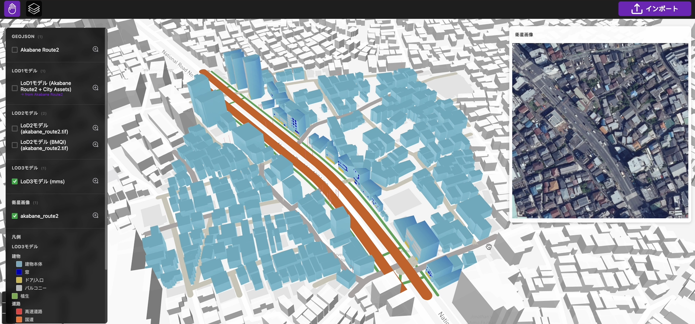

# 3D都市モデル生成シミュレータ

本リポジトリでは、Project PLATEAU 令和7年度ユースケース開発業務の一環として実施された「dt24-05 3D都市モデル生成シミュレータ」の成果である「3D都市モデル生成ツール」のソースコードを公開しています。

「3D都市モデル生成ツール」は、建物フットプリントデータ、衛星画像、およびMMSデータに基づき、建築物、道路、植生、都市設備を含む3D都市モデルを自動生成するWebベースのオーサリングツールです。本ツールは、衛星画像や沿道画像と生成AIを組み合わせることで、LOD1〜LOD3の詳細度に対応した3D都市モデルを生成できます。

