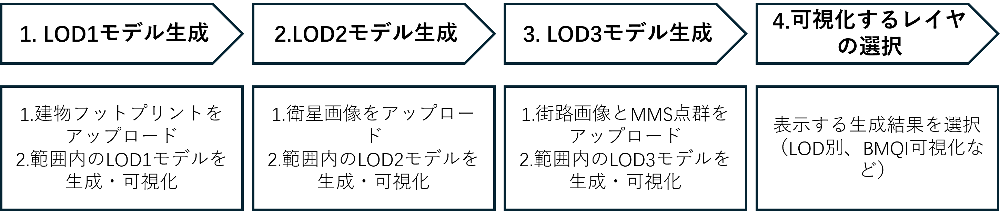
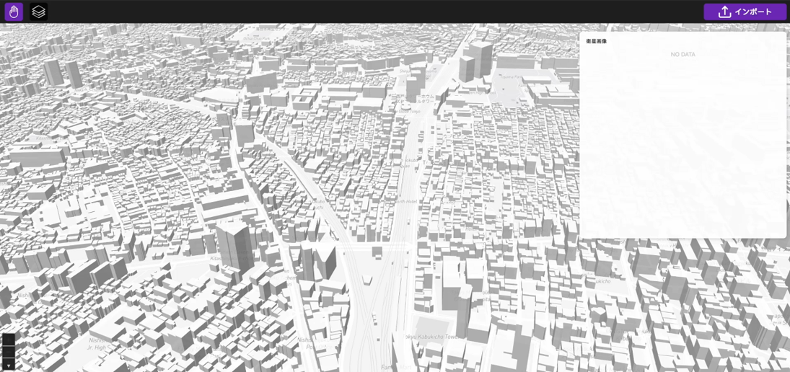
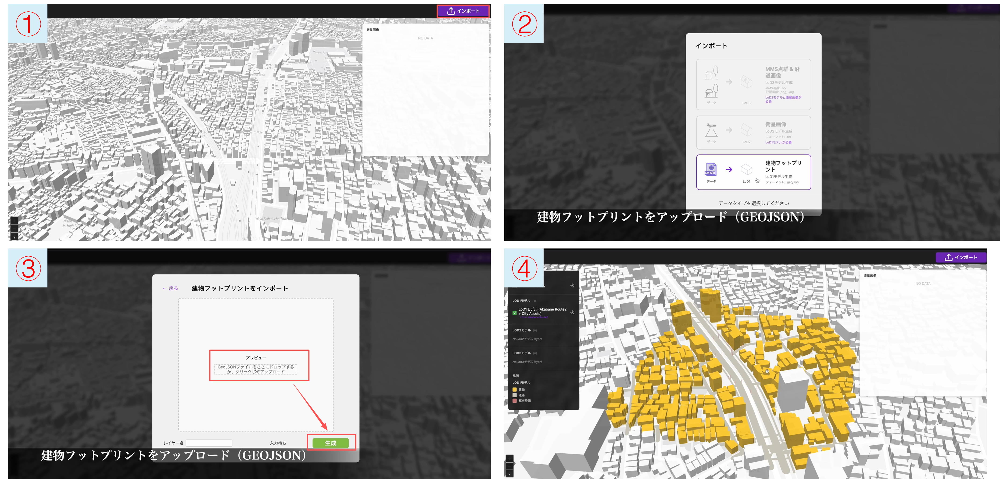
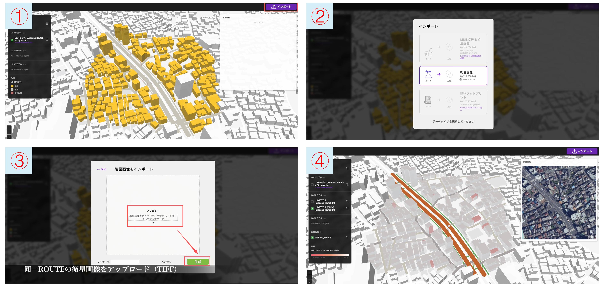
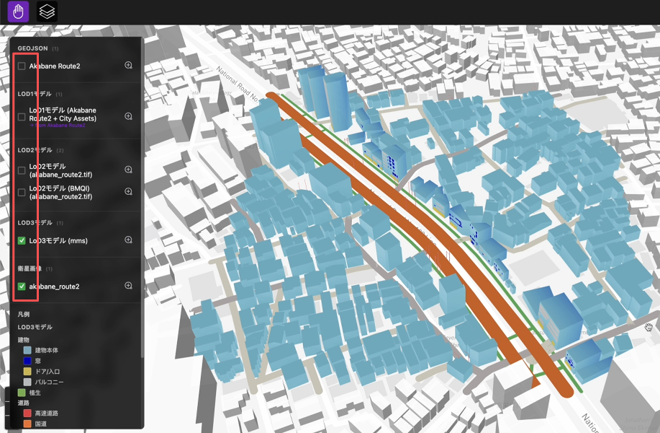

# User Manual

## About This Document

This document describes the operating procedures for the 3D City Model Generation Simulator system, hereafter referred to as "the system."

### Workflow for Generating a 3D City Model

## 1 LOD1 Model Generation

Access the digital city service and go to the generation screen. 
http://localhost:8080

1. Upload the building footprint and click "Generate." 
2. The LOD1 model within the building footprint data area is generated and visualized.

## 2 LOD2 Model Generation

1. Upload the satellite image and click "Generate."
2. The LOD2 model within the target area is generated and visualized.

## 3 LOD3 Model Generation

1. Upload the street images and MMS point cloud, then click "Generate."
2. The LOD3 model within the target area is generated and visualized.

## 4 Selecting Layers for Visualization

Select the generated-result layers to display, such as layers by LOD or BMQI visualization layers.

